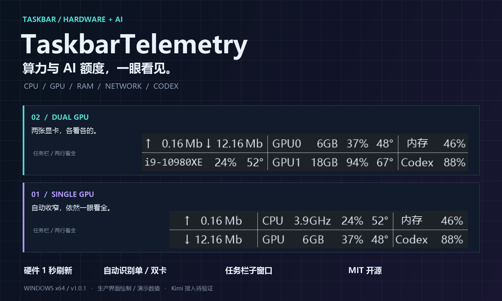
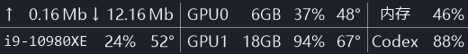
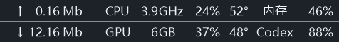
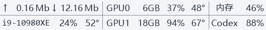
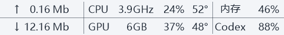

<div align="center">



# TaskbarTelemetry · Windows 任务栏监控与 Codex 额度监控

**算力与 AI 额度，一眼看见。**

把 CPU、GPU、内存、网速和 Codex 剩余额度，放进 Windows 任务栏的两行里。

An open-source **Windows taskbar system monitor** for CPU usage, NVIDIA GPU utilization, VRAM, temperatures, RAM, network speed and **Codex usage quota**. Adaptive single / dual GPU layouts, built with C# and WinForms.

[](#快速开始)
[](#两种布局自动适配)
[](#从源码构建)
[](LICENSE)
[](https://github.com/hanxiangmin/TaskbarTelemetry/releases/latest)

### [⬇ 下载 v1.0.1 Windows x64 便携版 · 解压即用](https://github.com/hanxiangmin/TaskbarTelemetry/releases/download/v1.0.1/TaskbarTelemetry-v1.0.1-windows-x64.zip)

[快速开始](#快速开始) · [界面预览](#两种布局自动适配) · [配置手册](docs/GUIDE.md) · [参与开发](CONTRIBUTING.md) · [反馈问题](https://github.com/hanxiangmin/TaskbarTelemetry/issues)

</div>

> **v1.0.1：展示图与下载包已同步。** 本版包含紧凑布局、Codex 每分钟主动刷新，以及 `Mb` 网速单位 / 去掉前导零的更新。[查看更新说明](docs/releases/v1.0.1.md)。旧版保留在发布历史中。

## 少切一次窗口，多看一眼状态

训练还在跑吗？显存快满了吗？下载有没有速度？Codex 额度还剩多少？

不用一直打开任务管理器，也不用反复翻额度页面。TaskbarTelemetry 把这些信息放在任务栏，适合写代码、跑模型、做实验，也适合日常查看电脑状态。

| 一眼看见 | 有什么用 |
| :--- | :--- |
| **CPU / GPU / 内存** | 同时看占用、显存和温度；单卡布局还展示 CPU 核心频率。传感器不可用时明确显示缺失。 |
| **Codex 剩余额度** | 直接显示套餐窗口的剩余百分比；悬停查看窗口、重置时间、更新时间与数据来源。 |
| **单卡 / 双卡自动适配** | 按真实 NVIDIA 设备数量选择布局。单卡更紧凑，双卡上下独立显示。 |
| **双向实时网速** | 上传、下载分开；使用与测速网页一致的 Mb/秒，如 `0.16 Mb`、`12.16 Mb`，不补前导零；默认每秒更新，数值变化不推挤列宽。 |
| **嵌入任务栏** | 使用任务栏子窗口，不是桌面级置顶悬浮窗；不额外占用 Alt+Tab 位置。 |
| **可选手机提醒** | Codex 用量跨档提醒，支持 Server酱³ / Turbo；默认关闭，由你主动授权。 |

## 两种布局，自动适配

### 双 GPU：两张卡，各看各的



左侧是网速和 CPU；中间两行分别显示 GPU0 / GPU1 的**显存、占用、温度**；右侧固定显示内存和 AI 额度。当前源码默认宽度 **520 个物理像素**，中间列两端保留分隔线留白。

### 单 GPU：更短，更紧凑



单卡自动收窄到 **476**。CPU / GPU 名称上下对齐，频率 / 显存的 **G 对齐**，占用率和温度各自成列；只有一张卡，就不再显示多余的 `0`。

<details>
<summary>☀️ 看看浅色主题</summary>





</details>

> 展示图由当前应用的 `TaskbarRenderer` 直接绘制，使用固定演示数值，不是实时桌面抓图，也不是性能测试结果。频率、温度及额度是否可用取决于设备、驱动和账户。图片中只展示已接入的 Codex。

## 快速开始

### 下载后直接运行

1. 下载 [**TaskbarTelemetry-v1.0.1-windows-x64.zip**](https://github.com/hanxiangmin/TaskbarTelemetry/releases/download/v1.0.1/TaskbarTelemetry-v1.0.1-windows-x64.zip)，不要选 `Source code`。
2. 右键 ZIP → **全部解压**，保留整个 `TaskbarTelemetry` 文件夹。
3. 双击 **TaskbarTelemetry.exe**，由你确认 Windows 管理员提示。小工具会出现在任务栏系统托盘左侧，自动识别单卡 / 双卡。

**无需 Visual Studio、.NET SDK 或自己编译。** 运行库已随包附带；系统需要 Windows 10 / 11 x64 和 .NET Framework 4.8。Codex 使用你自己的已登录环境，CPU 温度 / 频率可能需要额外的官方传感器后端。包内 `START-HERE.txt` 有完整操作说明。

从 v1.0.0 升级时请先退出旧实例，并使用新包的默认配置体验紧凑布局；直接复制旧 INI 可能保留旧版的宽度和 DPI 设置。需要保留偏好时请逐项合并。兼容性仍在完善，已知限制与未完成的桌面回归见 [VALIDATION](docs/VALIDATION.md)；下载包不代表所有环境均已验收。完整发布说明与校验文件见 [Releases](https://github.com/hanxiangmin/TaskbarTelemetry/releases/latest)。

### 从源码构建

需要 **Windows 10 / 11 x64、.NET Framework 4.8**。无需 Visual Studio 或 .NET SDK；构建使用系统自带的 .NET Framework C# 编译器。

```powershell
git clone https://github.com/hanxiangmin/TaskbarTelemetry.git
cd TaskbarTelemetry
.\run.ps1
```

`run.ps1` 会在需要时构建，并使用唯一的固定运行入口：`最新版\TaskbarTelemetry.exe`。保留同目录的配置和 `lib`，不要只拷贝 EXE。首次构建会下载固定版本的硬件库，并校验 SHA-256。仅构建、不启动时可运行 `.\build.ps1 -OutputDirectory .\最新版`；直接运行不带参数的 `build.ps1` 仍会输出到开发目录 `bin\Release`。

本地版双击时会自动请求管理员权限，**由你确认 Windows UAC**。程序不会静默安装驱动；CPU 温度 / 频率读取可能需要额外的官方硬件后端，见 [传感器说明](docs/GUIDE.md#cpu-温度仅非商店自编译版)。缺少传感器不影响其他指标。

- **悬停**：看硬件完整名称、额度窗口及失败原因。
- **右键**：打开配置、调整启动项、配置通知或退出。
- **自动布局**：正常启动按真实 NVIDIA 数量选择，不需要手动设显卡数量。
- **布局预览**：退出旧实例后运行 `TaskbarTelemetry.exe --preview-layouts`；预览禁用本进程通知，不禁用系统显卡。

若 Windows 阻止运行，请保留安全保护，不要关闭 Defender、Smart App Control 或驱动签名检查来绕过。与其他任务栏监控工具同时使用可能重叠，可调整 `ui.horizontalOffset`。

## AI 额度：显示清楚，也说清楚

| 来源 | 当前状态 | 显示口径 |
| :--- | :--- | :--- |
| **Codex** | 已接入 | 通用套餐额度主窗口的剩余百分比；官方 app-server 优先，本地近期额度快照可回退。 |
| **Kimi** | **待接入 / 尚未完成真实额度验证** | 目前只发现客户端，不展示未经验证的额度。安装或登录 Kimi Code 不等于工具已接通。 |
| 其他供应商 | 欢迎贡献适配器 | 必须提供真实套餐额度来源，不能拿会话 token 数、API 余额或钱包金额替代。 |

多来源展示框架已具备 **5 秒原位轮换、悬停暂停、过期提示**。只有真正取得有效额度的来源才参与轮换；没有来源时显示“未连接”。旧数值最多保留 5 分钟，失效后显示 `--%`，不会猜成 `100%`。

**注意：硬件每秒刷新不代表缓存额度是服务器实时值。** 当前源码将 Codex 主动查询设为每 60 秒、本地额度事件扫描设为每 1 秒；自动定位已安装的原生 Codex CLI，避免管理员启动时缺少终端 PATH 而只能读旧日志。额度窗口、来源、查询失败原因和更新时间可以在悬停提示中核对。当前通知只处理 Codex，不会自动向手机推送 Kimi 数据。

## 按你的习惯调整

编辑 EXE 旁的 `TaskbarTelemetry.ini`，保存后重启。完整选项见 [配置手册](docs/GUIDE.md#配置)。

```ini
[ui]
width=520
scaleWidthWithDpi=false
fontSize=8.5
foreground=Auto
background=Auto

[codex]
mode=auto
command=codex
home=

[notification]
enabled=false
thresholdPercent=10
dailyRequestLimit=5
```

双卡 CPU 型号会自动缩写为 `i9-10980XE`、`R9-9950X3D`、`U9-285K` 等固定宽度标签；无法可靠缩写时显示 `CPU`，完整名称保留在提示中。

## 隐私与兼容性

- 不内置账户、密钥或个人运行数据。通知默认关闭；SendKey 通过 Windows DPAPI 在本机加密保存。
- Codex 本地模式会临时扫描近期会话事件行，但只保留额度数字和时间；不打开 `auth.json`，不保存访问令牌，不上传会话内容。
- 官方 Codex app-server 模式的认证与联网由官方子进程负责；可选通知仅将必要额度信息发送至 Server酱。
- 首版 GPU 监控针对 **NVIDIA 1 / 2 卡**。无 NVIDIA 时使用单卡结构并显示 GPU 不可用；超过两张只展示前两张。AMD / Intel GPU 监控尚未实现。
- 目标是水平任务栏；多任务栏、竖向任务栏及所有 Windows / DPI 组合未全面验收。Store 构建保留，但不代表已上架；它不请求管理员权限，也不带 CPU 温度后端。

详见 [隐私说明](PRIVACY.md) · [兼容性](docs/COMPATIBILITY.md) · [安全问题报告](SECURITY.md)。

## 二次开发与贡献

欢迎 **Fork、修改布局、接入新额度来源、适配更多显卡**，也欢迎提交真实设备上的兼容性反馈。请先看 [CONTRIBUTING](CONTRIBUTING.md)，其中包含代码入口、验证步骤和额度适配约定。

```text
src/
  Collectors/        硬件与额度采集器
  Notifications/     Codex 阈值提醒与 Server酱发送
  TaskbarForm.cs     任务栏子窗口、菜单与生命周期
  TaskbarRenderer.cs 固定列宽与单 / 双卡绘制
  GpuTopology.cs     真实设备身份与数量
  QuotaPresentation.cs 来源状态、轮换与过期处理
tests/              场景测试与诊断探针
tools/              README 展示图生成
docs/               配置、兼容性与验收记录
```

主项目使用 **[MIT License](LICENSE)**，允许使用、修改和再分发，包括商业用途；再分发时须保留原有版权与许可声明。修改版建议注明来源与改动，避免被误认为官方发行版。第三方库保留各自许可证，见 [THIRD_PARTY_NOTICES](THIRD_PARTY_NOTICES.md)。

### 致谢

感谢 [TrafficMonitor](https://github.com/zhongyang219/TrafficMonitor) 提供任务栏监控交互与窗口机制的参考；本项目为独立 C# 实现，不是其分支。硬件传感器使用可选 [LibreHardwareMonitor](https://github.com/LibreHardwareMonitor/LibreHardwareMonitor) 后端，NVIDIA 数据来自已安装驱动的 NVML。

本项目为社区工具，与 Microsoft、NVIDIA、OpenAI 或 Moonshot AI 无官方隶属关系。

### 搜索关键词 / Keywords

Windows 任务栏监控 · 系统资源监控 · CPU 占用率 · GPU 显卡监控 · NVIDIA 显存监控 · 内存监控 · 实时网速 · 硬件温度 · Codex 额度查询 · AI 剩余额度 · 双显卡监控 · 开源桌面小工具

Windows taskbar monitor · system monitor · hardware monitoring · GPU utilization · VRAM usage · network speed monitor · Codex quota monitor · AI usage limits · NVIDIA NVML · C# WinForms
