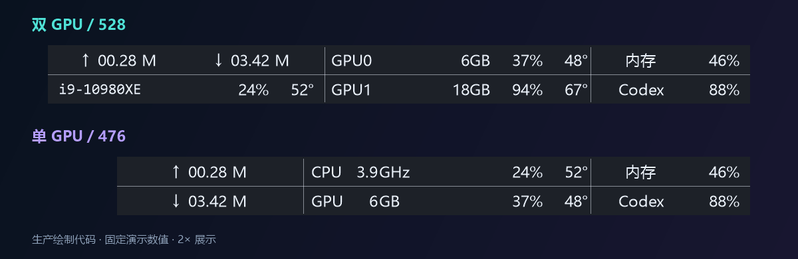

# TaskbarTelemetry 使用与配置手册

一个只占 Windows 任务栏空间的轻量实时监控工具。默认每秒刷新，不创建桌面悬浮窗。

## 显示内容

首版适配 1 / 2 块 NVIDIA 显卡；没有 NVIDIA 也能运行，其余指标不受影响。单卡采用更短的紧凑布局，双卡保留原有宽度。



| 模式 | 左列（上 / 下） | 中列（上 / 下） | 右列（上 / 下） |
|---|---|---|---|
| 双卡 | 上传＋下载 / CPU | GPU0 / GPU1 | 内存 / AI 剩余 |
| 单卡 | 上传 / 下载 | CPU＋频率 / GPU＋显存 | 内存 / AI 剩余 |

参考双卡宽度 528，双卡分列 208 / 200 / 120；单卡总宽 476，分列 140 / 216 / 120。配置中的 `ui.width` 是双卡参考宽度，单卡按 476/528 比例缩短，两种布局右侧对齐。图由当前生产绘制代码生成，使用演示数值；不显示尚未接通的 Kimi。

- 单卡只显示普通字体 `CPU` / `GPU`，两者左对齐，不加显卡编号；中间显示频率，如 `3.8 GHz`。频率 / 显存的数值和单位分开定位，GHz / GB 单位均左对齐，使 G 位于同一竖线；名称与数值槽之间最多留 2 个参考像素。双卡仍显示 GPU0 / GPU1（或配置的别名），CPU 名称固定为 10 个 Consolas 字位：2 位系列、横杠、最多 7 位型号；短型号留空，保留后缀。无法可靠缩写则显示 `CPU`，完整型号始终在悬停提示中。
- 单卡频率来自现有 LibreHardwareMonitor 0.9.6 的核心 Clock 传感器，显示库报告的各核心最高值；不是平均有效频率，也不保证与任务管理器口径一致。排除总线、平均与 Effective 时钟；不会自行用 WMI 标称频率补值。缺少硬件库 / 可用核心传感器 / 权限，或 Store 构建时显示 `-- GHz`，详情在悬停中。上游传感器有自己的硬件回退策略，不能将此显示声明为独立验证过的实时有效频率。
- NVIDIA 数量依据 NVML 返回的真实 UUID / PCI 身份，核显、虚拟显示器和采集失败占位不计入。温度缺失不改变布局；枚举暂时失败时保留已知身份并清空读数。超过两块只显示排序后的前两块。
- 显存、占用率、温度、额度名称和百分比分开定位；9% / 100%、Codex / Kimi 切换不改变槽位或分隔线。CPU / GPU 的占用率和温度在单卡模式上下对齐。
- 网速箭头、数值、单位也独立定位。M / G / T 分别表示 MiB/s / GiB/s / TiB/s；达到量级边界时改单位，避免无限扩张。显存 GB 是 GiB 的紧凑标记，悬停提供精确值。
- CPU 与内存占用使用 Windows 接口；NVIDIA 显存、占用及温度通过驱动 NVML 读取。CPU 温度使用可选 LibreHardwareMonitor 后端。
- 额度只表示套餐窗口的剩余百分比，不是会话 token 数、API 限速、账单或钱包余额。

## 直接运行

编译产物位于：

```text
bin\Release\TaskbarTelemetry.exe
```

如果 TrafficMonitor 仍在运行，请先退出它。两个程序默认都会占用系统托盘左侧的同一区域，同时运行会互相覆盖。需要临时并排测试时，可修改 `TaskbarTelemetry.ini` 的 `ui.horizontalOffset`。

监控窗口使用与 TrafficMonitor 相同的正常模式：作为 `Shell_TrayWnd` 的子窗口嵌入任务栏，而不是桌面级置顶悬浮窗。它不会出现在 Alt+Tab 或任务栏应用列表中。右键监控区域可以：

- 刷新任务栏位置；
- 打开配置文件；
- 配置、停用手机通知并查看隐私政策；
- 启用或关闭当前用户的开机启动；
- 退出程序。

### 在本机分别查看单卡 / 双卡

先退出已有实例，再以 `TaskbarTelemetry.exe --preview-layouts` 启动本地程序，并由用户确认 UAC。
预览从单卡开始，每 20 秒切换到另一种布局；悬停或打开菜单时暂停。
右键“布局预览”可固定单 GPU、固定双 GPU，或恢复按实际设备自动布局。

预览使用真实采集数据，只在显示层筛选前一张 / 前两张 NVIDIA 设备，不禁用系统显卡，不伪造不存在的设备。
只有检测到至少两张真实显卡才自动交替；少于两张时不会伪装双卡验证通过。
本次预览进程的通知功能关闭，不修改保存的配置或授权；退出后不带参数重开恢复正常模式。

## 构建与测试

要求 Windows 10/11 x64 和 .NET Framework 4.8。项目不要求 Visual Studio 或 .NET SDK，使用系统自带的 .NET Framework C# 编译器。

```powershell
Set-Location .\TaskbarTelemetry
.\build.ps1
.\test.ps1
.\run.ps1
```

`build.ps1` 会从 LibreHardwareMonitor 官方 GitHub release 下载固定版本的依赖，并校验固定 SHA-256。只发布 CPU 路径所需的 5 个 DLL，运行目录约 1.7 MiB；测试探针单独放在 `test-artifacts`，不会混入正式目录。

## Microsoft Store / MSIX

商店版继续使用相同的 WinForms 程序，但把配置、同意、加密密钥和通知状态保存到当前应用包隔离的 `LocalState\TaskbarTelemetry`，并用 MSIX `startupTask` 接入 Windows“启动应用”设置。商店包本身保持 `asInvoker`，不安装驱动或服务。为避免第三方驱动依赖，Microsoft Store 构建会排除 CPU 温度后端及其库；CPU 占用、NVIDIA GPU 温度和其他核心指标不受影响。

生成结构验证用的预览包：

```powershell
./build-store.ps1 -Preview
```

预览包使用占位身份，只用于 MakeAppx 结构验证，不能上传商店。保留应用名称后，从 Partner Center 的 Product identity 页面复制三个身份字段，把 `store/store-identity.example.json` 另存为被忽略的 `store/store-identity.json` 并原样填写，然后运行：

```powershell
./build-store.ps1
```

最终未签名 MSIX 位于 `artifacts/store`；Microsoft Store 会在认证通过后为包签名。商店文案、认证备注、隐私政策、截图和逐项清单均在 `store` 目录。

## CPU 温度（仅非商店自编译版）

本节不适用于 Microsoft Store 版；商店包不包含、推荐或依赖 LibreHardwareMonitor/PawnIO。非商店自编译版可选用 LibreHardwareMonitor 0.9.6；许多 CPU 无法通过标准 WMI 提供封装温度，因此可能需要低层传感器后端。非商店版：

- 不包含 WinRing0；
- 不包含或静默安装任何 `.sys` 驱动；
- 本地版主程序清单为 `requireAdministrator`，双击 EXE 时由 Windows 自动弹出 UAC；商店版仍为 `asInvoker`；
- 如果 PawnIO 未安装、权限不足或传感器不可读，CPU 温度显示 `--°`，鼠标提示会显示具体原因，其余监控不受影响。

若确实需要 CPU 温度，只安装 [PawnIO 官网](https://pawnio.eu/)“Download Now”提供的官方签名版：

1. 先退出 TaskbarTelemetry 和其他硬件监控程序；
2. 运行下载的 `PawnIO_setup.exe`，接受 UAC；
3. 保持默认的 **Official edition**，不要选择面向开发者的未签名 **Unrestricted edition**；
4. 安装器要求重启时再重启，然后重新运行 TaskbarTelemetry。

PawnIO 的默认设备权限仅开放给系统和管理员。本地版 TaskbarTelemetry 会在双击时请求管理员权限，不再需要右键选择“以管理员身份运行”；Microsoft Store 版仍保持 `asInvoker`，且不包含 CPU 温度后端。不要为此降低驱动设备权限、启用 Windows 测试签名模式、关闭 Defender 或添加排除项。安装内核驱动属于系统级变更，本项目不会代替用户执行。

相关上游：[LibreHardwareMonitor](https://github.com/LibreHardwareMonitor/LibreHardwareMonitor) 与 [v0.9.6 release](https://github.com/LibreHardwareMonitor/LibreHardwareMonitor/releases/tag/v0.9.6)。

## Codex 额度模式与隐私边界

在 `[codex]` 中选择一种模式：

| 模式 | 行为 |
| --- | --- |
| `local` | 只读扫描最近 Codex 会话 JSONL 尾部的事件行，从 `rate_limits` 快照中保留额度数字。 |
| `appserver` | 仅使用 OpenAI 文档化的 Codex app-server 协议；失败时不会读取本地会话。需要 `command` 指向可独立运行的 Codex CLI。 |
| `auto`（默认） | 优先通过 app-server 查询服务器当前额度；尚未取得额度时才回退到本地会话快照。 |
| `off` | 完全关闭 Codex 额度采集。 |

本地模式的准确边界：

- 会枚举 `CODEX_HOME\sessions` 与 `CODEX_HOME\archived_sessions`，最多检查最近 20 个 JSONL 文件，每个最多扫描尾部 4 MiB；
- 扫描过程中会临时读到这些事件行，但只解析带有额度字段的 `event_msg/token_count`；当快照含额度 ID 时，只选通用 `codex` 额度并跳过 GPT-5.3-Codex-Spark 等模型专属额度，内存缓存只保存 plan 类型、百分比、窗口时长和重置时间；
- 不打开 `auth.json`，不读取或保存 access token，不上传会话内容；
- 本地 JSONL 是 Codex 的内部缓存格式，可能随版本变化；它是最近观察到的快照，不是实时权威查询。重置时间已经过去的窗口会被丢弃并显示 `--%`。

app-server 模式下，认证和联网由官方 Codex 子进程负责；TaskbarTelemetry 不读取凭据，但会短暂接收协议响应中的账户元数据，最终只保留 plan 类型和额度字段。官方协议说明见 [Codex App Server 文档](https://learn.chatgpt.com/docs/app-server)。

界面中的“剩余”由通用 Codex 额度窗口的 `usedPercent` 计算为 `100 - usedPercent`。程序仍兼容协议中的其他窗口及旧版未标注额度 ID 的快照，但任务栏、鼠标提示和额度通知只使用通用额度，不使用 GPT-5.3-Codex-Spark 的独立额度。`codex.refreshSeconds` 同时控制本地扫描或 app-server 查询频率，当前配置与任务栏重绘均为 1 秒。

## 多来源额度与 Kimi 验证关卡

- 一个已连接来源固定显示；两个已连接来源每 5 秒原位轮换，悬停暂停，离开后继续。名称和百分比来自同一份快照。
- 从未取得有效额度的来源不加入轮换；两者都没有时显示“未连接”。已连接来源短暂失败后保留位置，旧值显示“·”并在提示中注明过期；最后一次有效数据满 5 分钟或窗口已重置后显示 `--%`。
- 提示列出各来源的窗口、重置和更新时间。重新读同一条缓存不会延长其有效期。关闭重启不会把超过五分钟的旧缓存当成新连接。
- Codex 保留原采集方式。Kimi 发现工作在独立线程，每 60 秒检查，不阻塞每秒硬件采集。通知仍然**只处理 Codex**。

**当前 Kimi 实现停留在只读来源验证关卡。** 本机可检测到 Kimi 桌面安装，但没有已验证的账户套餐额度接口；检测到客户端不等于取得额度，因此运行时不会凭空显示 Kimi 数值。没有额外登录、安装或强制连接步骤，也不读取 Cookie、OAuth 凭据、聊天内容或钱包数据。

官方 Kimi Code CLI 文档描述了本地 `GET /api/v1/oauth/usage`，但该服务与 Kimi 桌面版不是同一个接口，需要本地服务身份和 bearer 授权。当前版本**未接通该接口**，也不猜测服务注册文件或令牌字段。未来接通后必须以真实响应与账户界面对照验收，不能把轮换场景测试称为 Kimi 实测通过。参考：[官方服务 API](https://www.kimi.com/code/docs/kimi-code-cli/reference/server-api.html)。

## 手机额度通知（Server酱³ / 微信）

工具支持 [Server酱³](https://sc3.ft07.com/sendkey) 和 Server酱 Turbo，按 SendKey 自动选择官方接口。Server酱³ 的 `sctp数字t密钥` 发送到 `https://数字.push.ft07.com/send/完整SendKey.send`，使用独立 App 接收；Turbo 的 `SCT` 密钥发送到 `https://sctapi.ftqq.com/完整SendKey.send`，使用微信等已配置通道接收。两个版本的密钥不通用，接收方式见 [官方说明](https://sct.ftqq.com/docs/getting-started/sendkey/)。当前配置在首次看到额度时只建立基线；之后每跨过 10%、20%……100% 档位推送一条。一次快照跨过多个档位时会合并为一条，额度窗口重置后自动重新布防。

通知默认关闭。推荐直接在应用中配置：

1. 在 [Server酱³ SendKey 页面](https://sc3.ft07.com/sendkey) 复制以 `sctp` 开头的完整密钥，并安装、登录对应的手机 App；也可继续使用 Turbo 的 `SCT` 密钥；
2. 右键任务栏监控区域，选择“通知与隐私设置...”，阅读发送内容和第三方服务说明；
3. 粘贴 SendKey、主动勾选同意并保存，然后退出并重新打开 TaskbarTelemetry；
4. 右键选择“发送通知测试消息”；弹窗会确认已排队，接口发送结果会显示在鼠标悬停状态中。接口成功表示服务已接收，不保证手机已经显示通知。

未打包开发版也可运行旧兼容脚本 `./configure-serverchan.ps1` 保存固定名称的用户环境变量，但仍应通过应用内设置明确启用通知。Microsoft Store 版不会读取或修改这个旧环境变量。

SendKey 不会写入 INI 或日志；应用使用 Windows 当前用户数据保护（DPAPI）加密后保存。额度通知只发送已用/剩余百分比、窗口时长和重置时间，不发送会话正文。未打包版状态保存在 `%LOCALAPPDATA%\TaskbarTelemetry`；商店版状态保存在该包隔离的 `LocalState\TaskbarTelemetry`。

默认 `notification.dailyRequestLimit=5` 是应用的本地每日请求上限，测试消息和重试也会计数；它不代表 Server酱³ 套餐的剩余额度。达到本地上限后，当天后续档位只记录、不请求，第二天遇到新档位时恢复发送。完整 0%–100% 窗口有 10 个档位；可根据自己账户的套餐调整，`0` 表示不做本地限制，服务端限制仍然有效。

## 配置

未打包版编辑与 EXE 同目录的 `TaskbarTelemetry.ini`；MSIX 商店版首次运行会把模板复制到 `%LOCALAPPDATA%\Packages\<PackageFamilyName>\LocalState\TaskbarTelemetry\TaskbarTelemetry.ini`，右键“打开配置文件”会直接打开正确副本。修改后重启程序：

- `monitor.refreshMilliseconds`：系统/GPU/UI 刷新间隔，当前为 1000 ms；
- `ui.width`：任务栏参考宽度；新配置 `ui.scaleWidthWithDpi=true` 按 DPI 等比放大。旧 INI 缺少该项时保留原来的物理像素宽度；
- `ui.horizontalOffset`、`ui.verticalOffset`：位置微调；
- `ui.fontFamily`、`ui.fontSize`、`ui.foreground`、`ui.background`：字体与颜色；
- `network.interfaceId`：留空自动汇总，填写网卡 ID 可固定；
- `cpu.alias`：留空时通过 Windows WMI 自动识别并缩短 CPU 型号，也可填写同样满足 2+1+7 规则的标签手动覆盖；
- `gpu.alias0`、`gpu.alias1`：两张卡的短标签，当前为 GPU0/GPU1；
- `temperature.enabled`、`temperature.libreHardwareMonitorLibrary`：非商店版 CPU 温度开关与库路径；商店构建强制关闭；
- `codex.mode`、`codex.command`、`codex.home`、`codex.refreshSeconds`：Codex 采集方式，当前刷新间隔为 1 秒。
- `notification.enabled`：是否启用 Server酱手机通知；
- `notification.thresholdPercent`：提醒步长，当前为每消耗 10%；
- `notification.dailyRequestLimit`：本地每日最多请求数，默认 5，`0` 表示不作本地限制；

配置修改后需要重启。状态与失败原因可通过鼠标悬停查看。

## 安全设计

- 代码从零实现，没有复制 TrafficMonitor 或 token-monitor 的源码。
- 发布目录不包含 `.sys`、WinRing0、服务安装器或 Defender 排除操作；本地版只通过标准应用清单请求管理员权限，商店版保持 `asInvoker`。
- NVML 只从 `%WINDIR%\System32\nvml.dll` 的绝对路径加载，避免 DLL 搜索路径劫持。
- 程序只写入当前用户的配置、同意、加密密钥和通知状态；商店版全部位于包隔离的 LocalState，未打包版位于 `%LOCALAPPDATA%\TaskbarTelemetry`。开机启动只在用户主动选择时配置。
- Server酱 SendKey 使用 DPAPI 当前用户范围加密，不进入仓库、发布目录或日志；HTTP 端点固定为 Server酱官方 HTTPS 地址，并禁用自动重定向。
- 通知默认关闭；商店版只有在应用内明确同意后才启用，并提供立即停用、撤销同意、删除 SendKey 与本地通知状态的入口。
- 本地自编译 EXE 默认没有商业代码签名证书。无签名本身可能降低 SmartScreen 声誉，但它和包含已知脆弱驱动是两类问题；正式公开发布时建议使用可信证书签名并发布哈希。

## 开源交付与验收

运行 `./package-release.ps1`：先构建和测试，再用明确的文件清单生成源码 ZIP、运行包 ZIP 和 SHA-256 清单。只打包默认配置、源码、构建脚本、许可、兼容性文档及演示截图；不包含本机运行状态、密钥、用户路径、Git 历史或开发产物。

兼容边界与尚未完成的真实环境验收见 [兼容性说明](COMPATIBILITY.md) 和 [验收记录](VALIDATION.md)。GitHub 首次公开定位为源码预览，完整桌面回归通过后再发布稳定运行包。

## 许可证

TaskbarTelemetry 使用 MIT License。第三方依赖与许可证说明见 `THIRD_PARTY_NOTICES.md`。
